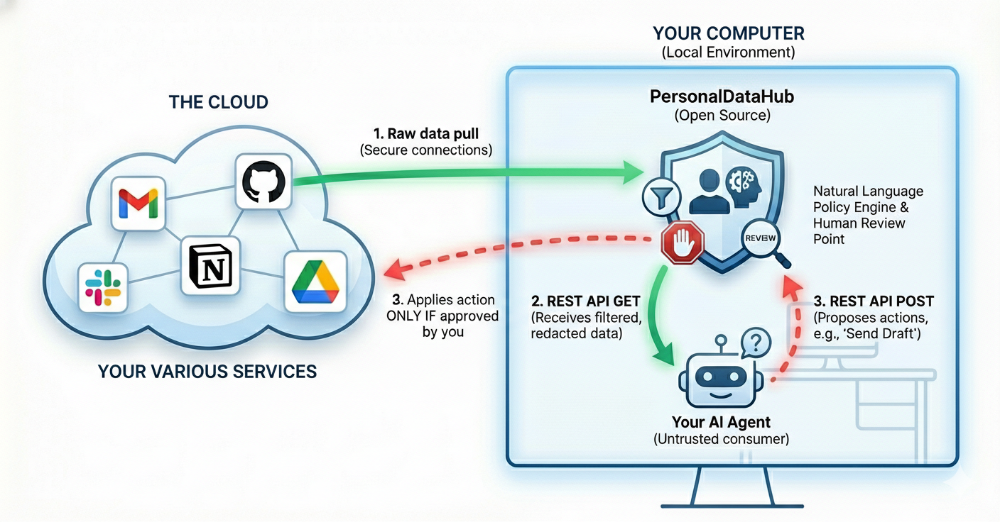

# PersonalDataHub


PersonalDataHub is an open-source, self-hosted data hub between the services that manage your personal data (Gmail, GitHub, etc.) and your AI agents. It connects to your services via OAuth2, and lets agents query them through an MCP server or REST API — all running locally on your machine, with no data sent to third parties. You configure quick filters to control what agents can see, and review every action they propose before it's executed.




### How it works

1. **You connect** your accounts via OAuth2 — PersonalDataHub stores the tokens locally
2. **You configure** quick filters to control what the agent can see: date ranges, senders, subjects, hidden fields
3. **Agents discover tools** via MCP (source-specific tools like `read_emails`, `search_github_issues`) or call the REST API directly
4. **You review** every outbound action (drafts, replies) before it's sent — nothing goes out without your approval

You do not need to give agents direct access to your accounts. Agents see nothing by default — you explicitly whitelist access.

## Quick Start

```bash
git clone https://github.com/AISmithLab/PersonalDataHub.git
cd PersonalDataHub
pnpm install && pnpm build
npx pdh init
npx pdh start
open http://localhost:3000
```

This installs dependencies, initializes the database, and starts the server. Save the **owner password** printed during init — you need it to log into the GUI.

See the [Setup Guide](docs/SETUP.md) for connecting data sources and your agent.

## Agent Integration

Add PersonalDataHub as an MCP server in your agent's config. For Claude Code, add to `.claude/settings.json`:

```json
{
  "mcpServers": {
    "personaldatahub": {
      "command": "npx",
      "args": ["pdh", "mcp"]
    }
  }
}
```

The MCP server dynamically registers tools based on which sources you've connected via OAuth. No tools appear for disconnected sources.

## Features

### Data Sources

| Source | Read | Write |
|--------|------|-------|
| **Gmail** | Emails (filtered by date, labels) | Draft / reply / send (staged for approval) |
| **GitHub** | Issues and PRs from selected repos | Via agent's own scoped credentials |

New sources can be added by implementing the `SourceConnector` interface.

### Tools

Tools are source-specific and only appear when the source is connected via OAuth:

| Tool | Source | Description |
|------|--------|-------------|
| `read_emails` | Gmail | Pull emails, filtered by owner's policy |
| `draft_email` | Gmail | Create a draft (staged for approval) |
| `send_email` | Gmail | Send an email (staged for approval) |
| `reply_to_email` | Gmail | Reply to an email (staged for approval) |
| `search_github_issues` | GitHub | Search issues across selected repos |
| `search_github_prs` | GitHub | Search pull requests across selected repos |

### Quick Filters

Control what data agents can see using simple toggle-based filters in the GUI:

| Filter | What it does |
|--------|-------------|
| **Only emails after** | Drop rows before a given date |
| **Only from sender** | Keep rows where sender contains a value |
| **Subject contains** | Keep rows where subject contains a value |
| **Exclude sender** | Drop rows where sender matches |
| **Exclude subject containing** | Drop rows where subject matches |
| **Only with attachments** | Keep only rows that have attachments |
| **Hide field from agents** | Remove a field (e.g., body) before delivery |

Filters are stored in the database and applied at read time.

### Action Staging

When an agent wants to send an email or create a draft, the action enters a **staging queue**. Nothing is executed until you review and approve it in the GUI. You can also edit the draft before approving.

### Web GUI

A built-in admin dashboard at `http://localhost:3000` (password-protected) for:

- **Sources** — connect Gmail/GitHub via OAuth, configure boundaries (date range, labels, repos)
- **Filters** — toggle quick filters to control what agents can see
- **Staging** — review, edit, approve, or reject proposed agent actions
- **Settings** — browse the audit log, select GitHub repos

### Audit Log

Every data access and action is logged with a purpose string, timestamp, source, and initiator. Queryable from the GUI or the database directly.

## API

Two endpoints. No auth required — the server binds to `127.0.0.1` (localhost only).

### Pull Data

```
POST /app/v1/pull
```

```json
{
  "source": "gmail",
  "purpose": "Find emails about Q4 report to summarize for user"
}
```

Response data is filtered according to the owner's quick filter configuration.

### Propose Action

```
POST /app/v1/propose
```

```json
{
  "source": "gmail",
  "action_type": "draft_email",
  "action_data": {
    "to": "bob@company.com",
    "subject": "Re: Q4 Report",
    "body": "Thanks Bob, the numbers look good."
  },
  "purpose": "Draft reply to Bob about Q4 report"
}
```

Actions are staged for owner review — not executed until approved via the GUI.

### Discover Sources

```
GET /app/v1/sources
```

Returns which sources are configured and which have active OAuth connections. Used by the MCP server for dynamic tool registration.

## Architecture

### Core Principles

- **Zero access by default** — every piece of data, every repo, every action must be explicitly allowed
- **On-the-fly** — fetches from source APIs on demand; nothing written to disk beyond OAuth tokens and the audit log
- **Outbound control** — actions like sending email are staged for owner review; for sources like GitHub where the agent has its own credentials, PersonalDataHub layers additional boundary controls on top
- **Auditable** — every data movement is logged with a purpose string

### Three Layers of Access Control

1. **Credential scope** — the agent holds a scoped identity that can't access resources outside the boundary
2. **Query boundary** — the connector refuses to fetch data outside configured limits (date range, repo list, label filters)
3. **Quick filters** — further restrict which rows are visible and which fields are delivered to the agent

### Tech Stack

- **Runtime:** Node.js 22+
- **Framework:** [Hono](https://hono.dev)
- **Database:** SQLite via better-sqlite3
- **Auth:** PKCE OAuth (Gmail, GitHub), bcrypt password hashing, AES-256-GCM token encryption
- **Agent Protocol:** MCP (Model Context Protocol) via `@modelcontextprotocol/sdk`
- **Config:** YAML with Zod validation and `${ENV_VAR}` support

### Project Structure

```
src/
├── auth/           OAuth flows, PKCE, token management
├── config/         YAML config loading + Zod schema
├── connectors/     Source adapters (Gmail, GitHub)
├── db/             SQLite schema, encryption helpers
├── filters.ts      Quick filter types, catalog, and apply logic
├── mcp/            MCP stdio server with source-specific tools
├── server/         HTTP server + app API routes
├── gui/            Web admin dashboard
├── audit/          Immutable audit trail
├── cli.ts          CLI commands (init, start, stop, status, mcp, reset)
└── index.ts        Server entrypoint
```

## CLI Commands

```
npx pdh init [app-name]   Bootstrap a new installation
npx pdh start             Start the server in the background
npx pdh stop              Stop the background server
npx pdh status            Check if the server is running
npx pdh mcp               Start a stdio MCP server for agent access
npx pdh reset             Remove all generated files and start fresh
```

## Security Model

PersonalDataHub is designed to run on **your local machine**. The owner's OAuth tokens and encryption keys never leave the host and are never exposed to the agent.

**What the agent cannot do:**
- Access any data outside the configured boundary (date range, repos, labels)
- See fields hidden by quick filters (e.g., body can be stripped)
- See rows excluded by active filters (e.g., emails from specific senders)
- Send emails or execute actions without owner approval
- Delete anything — no destructive endpoints exist

**Known limitations:**
- Once data passes through filters and reaches the agent, PersonalDataHub can't control what the agent does with it — network sandboxing at the agent runtime level is the mitigation
- A host-level compromise (attacker reads `hub-config.yaml` and `.env`) gives access to the owner's OAuth tokens and encryption keys — host-level security (disk encryption, OS access controls) is the owner's responsibility
- No built-in rate limiting yet (future enhancement)

For the full threat model with attack/mitigation tables for Gmail and GitHub, see [SECURITY.md](docs/SECURITY.md).

## Documentation

- [Setup Guide](docs/SETUP.md) — install, connect sources, and connect your agent
- [OAuth Setup](docs/OAUTH-SETUP.md) — using your own OAuth credentials instead of the defaults
- [Development Guide](docs/DEVELOPMENT.md) — codebase structure, adding connectors, testing
- [Security & Threat Model](docs/SECURITY.md) — detailed attack surface analysis for Gmail and GitHub
- [Design Doc](docs/architecture-design/design-v1.md) — full architecture and design rationale

## License

Apache 2.0
