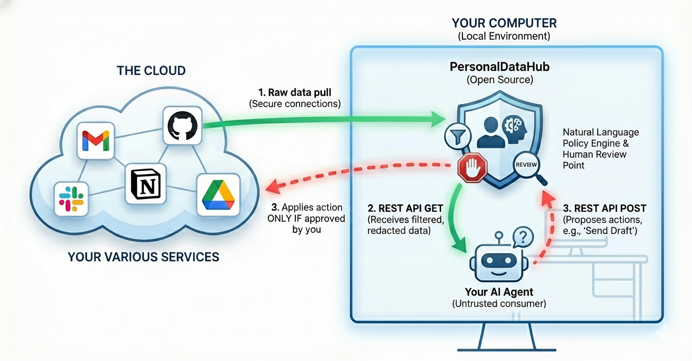

# PersonalDataHub

**An open-source, self-hosted data hub between your personal services (Gmail, GitHub, etc.) and your AI agents.**

PersonalDataHub connects to your accounts via OAuth2 and lets AI agents query them through MCP or REST API — all running locally on your machine, with no data sent to third parties. You configure quick filters to control what agents can see, and review every action they propose before it's executed.



---

## Features

- **Zero access by default** — agents see nothing until you explicitly whitelist access
- **OAuth2 integration** — connect Gmail, GitHub, and more with secure PKCE OAuth flows
- **Quick filters** — control what agents can see: date ranges, senders, subjects, hidden fields
- **Action staging** — every outbound action (drafts, replies, sends) is queued for your review and approval before execution
- **MCP server** — agents discover tools via the Model Context Protocol (works with Claude Code, Cursor, Windsurf)
- **Skills** — high-level workflows (e.g., email-assistant) that orchestrate multi-step tasks on top of MCP tools
- **REST API** — pull data and propose actions via simple HTTP endpoints
- **Web GUI** — built-in admin dashboard for managing sources, filters, staging, and audit logs
- **Audit log** — every data access and action is logged with purpose, timestamp, source, and initiator
- **AES-256-GCM encryption** — OAuth tokens are encrypted at rest
- **Multiple agents** — connect Claude Code, Cursor, Windsurf, or any MCP-compatible client simultaneously
- **Extensible** — add new data sources by implementing the `SourceConnector` interface

### Data Sources

| Source | Read | Write |
|--------|------|-------|
| **Gmail** | Emails (filtered by date, labels) | Draft / reply / send (staged for approval) |
| **GitHub** | Issues and PRs from selected repos | Via agent's own scoped credentials |

---

## Installation & Authentication

### Prerequisites

- **Node.js** 22+
- **pnpm** (package manager)
- A **Gmail** and/or **GitHub** account to connect

### 1. Install and Start the Server

```bash
git clone https://github.com/AISmithLab/PersonalDataHub.git
cd PersonalDataHub && pnpm install && pnpm build

# Initialize (save the owner password it prints)
npx pdh init

# Start the server
npx pdh start
```

### 2. Connect Your Sources via OAuth

Open `http://localhost:3000` in your browser.

1. Click **Connect Gmail** — authenticate via Google's OAuth2 consent screen
2. Click **Connect GitHub** — authenticate via GitHub's OAuth2 flow
3. Configure **quick filters** to control what agents can see

> To use your own OAuth credentials instead of the defaults, see [OAuth Setup](systemdesigns/OAUTH-SETUP.md).

### 3. Connect Claude Code

Add PersonalDataHub as an MCP server in `.claude/settings.json`:

```json
{
  "mcpServers": {
    "personaldatahub": {
      "command": "npx",
      "args": ["pdh", "mcp"]
    }
  }
}
```

**Cursor / Windsurf** — add PersonalDataHub as an MCP server using the same command: `npx pdh mcp`

> For **OpenClaw** setup (with OS-level user separation for stronger isolation), see the [OpenClaw Setup Guide](systemdesigns/OPENCLAW-SETUP.md).

---

## Available Tools

Tools are source-specific and only appear when the source is connected via OAuth:

### `read_emails`

Pull emails filtered by the owner's quick filter policy.

```json
{
  "source": "gmail",
  "purpose": "Find emails about Q4 report to summarize for user"
}
```

### `draft_email`

Create a draft email (staged for owner approval before saving).

```json
{
  "to": "bob@company.com",
  "subject": "Re: Q4 Report",
  "body": "Thanks Bob, the numbers look good."
}
```

### `send_email`

Send an email directly (staged for owner approval before sending).

### `reply_to_email`

Reply to an existing email thread (staged for owner approval).

### `search_github_issues`

Search issues across selected repositories.

### `search_github_prs`

Search pull requests across selected repositories.

---

## Quick Filters

Control what data agents can see using simple toggle-based filters in the GUI:

| Filter | What it does |
|--------|-------------|
| **Only emails after** | Drop rows before a given date |
| **Only from sender** | Keep rows where sender contains a value |
| **Subject contains** | Keep rows where subject contains a value |
| **Exclude sender** | Drop rows where sender matches |
| **Exclude subject containing** | Drop rows where subject matches |
| **Only with attachments** | Keep only rows that have attachments |
| **Hide field from agents** | Remove a field (e.g., body) before delivery |

---

## Skills

Skills are high-level workflows that orchestrate PersonalDataHub's REST API to handle multi-step tasks.

| Skill | Description |
|-------|-------------|
| [`email-assistant`](skills/email-assistant/SKILL.md) | Parse a natural language email request, search for relevant emails, analyze context, and draft a response |

**Installation (Claude Code):** Copy the skill folder to `~/.claude/skills/`, then invoke with `/email-assistant`.

---

## CLI Commands

```
npx pdh init [app-name]     Bootstrap a new installation
npx pdh start               Start the server in the background
npx pdh stop                Stop the background server
npx pdh status              Check if the server is running
npx pdh mcp                 Start a stdio MCP server for agent access
npx pdh install-service     Install a systemd/launchd service for auto-start on reboot
npx pdh uninstall-service   Remove the auto-start service
npx pdh reset               Remove all generated files and start fresh
```

---

## Security Model

PersonalDataHub runs on **your local machine**. OAuth tokens are encrypted at rest with AES-256-GCM and the server binds to `127.0.0.1` (localhost only).

**Three layers of access control:**

1. **Credential scope** — the agent holds a scoped identity that can't access resources outside the boundary
2. **Query boundary** — the connector refuses to fetch data outside configured limits (date range, repo list, label filters)
3. **Quick filters** — further restrict which rows are visible and which fields are delivered to the agent

**What the agent cannot do:**

- Access any data outside the configured boundary
- See fields hidden by quick filters
- Send emails or execute actions without owner approval
- Delete anything — no destructive endpoints exist

For the full threat model, see [SECURITY.md](systemdesigns/SECURITY.md).

---

## Demo

https://github.com/user-attachments/assets/62e7a26a-44a6-4a78-8b99-59e66b1e8464

---

## Mobile App (Android / iOS)

PersonalDataHub runs as a self-contained Android or iOS app using React Native. The existing Hono backend runs in a native Node.js Mobile background thread; the UI is a WebView loading `127.0.0.1:3000`.

```bash
cd mobile && npm install && npm run build:android
```

See the [Android Build Guide](systemdesigns/ANDROID-BUILD-GUIDE.md) for full setup, prerequisites, and troubleshooting.

---

## Documentation

- [Setup Guide](systemdesigns/SETUP.md) — install, connect sources, and connect your agent
- [Android Build Guide](systemdesigns/ANDROID-BUILD-GUIDE.md) — build and run the Android/iOS app
- [OpenClaw Setup](systemdesigns/OPENCLAW-SETUP.md) — install with OS-level user separation for OpenClaw
- [OAuth Setup](systemdesigns/OAUTH-SETUP.md) — using your own OAuth credentials
- [Development Guide](systemdesigns/DEVELOPMENT.md) — codebase structure, adding connectors, testing
- [Security & Threat Model](systemdesigns/SECURITY.md) — detailed attack surface analysis
- [Design Doc v2](systemdesigns/architecture-design/design-v2.md) — full architecture and design rationale
- [Skills vs MCP](systemdesigns/architecture-design/skills-vs-mcp.md) — when to use skills vs MCP tools

## License

Apache 2.0
