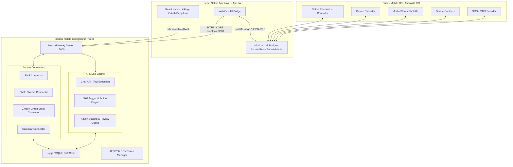
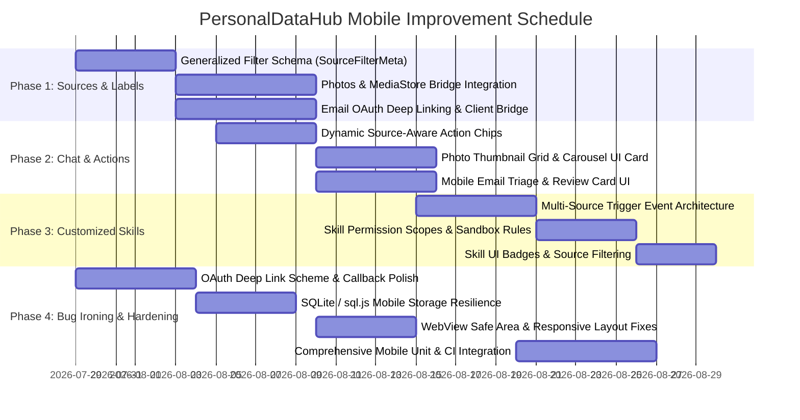

# PersonalDataHub — Mobile App Improvement Roadmap

> **Target Platform:** Android & iOS (React Native + `nodejs-mobile-react-native` + Hono/WebView)  
> **Date:** July 2026  
> **Scope:** Complete technical roadmap addressing mobile-first data sources, chat UI/actions, multi-source skills, and native/runtime hardening.  
> **Full Document Path:** [`docs/mobile-app-roadmap.md`](../docs/mobile-app-roadmap.md)

---

## Executive Summary

PersonalDataHub brings self-hosted, zero-access personal data integration to mobile devices by running an embedded Hono server inside a native background thread (`nodejs-mobile-react-native`) and presenting a responsive UI via React Native WebView. 

Based on recent user feedback and mobile UI/UX audits, this roadmap establishes a structured 4-phase implementation plan to transform the mobile experience:

1. **Add More Data Sources & Generalized Labeling:** Bridge native device Photos/Media and local Calendar alongside existing SMS and Contacts; replace Gmail-specific hardcoded filter labels with a generalized, multi-source labeling and filtering schema.
2. **Revamp Chat Labels & Actions (`photo` & `emails`):** Replace static chat quick-action buttons with dynamic, source-aware chips; implement rich interactive chat cards for Photo galleries, image previews, and Email triage/drafting.
3. **Customized Data Source Skills:** Expand the Skill workflow engine beyond SMS triggers to support multi-source mobile triggers (`photo_added`, `email_received`, `calendar_event_starting`), enforcing explicit source permission boundaries per Skill.
4. **Iron Out Final Mobile Bugs:** Resolve critical Android/iOS bridging edge cases, OAuth deep-link returns, SQLite/`sql.js` native binding fallbacks, background thread lifecycle resilience, and mobile UI responsiveness.

---

## Architectural Overview



---

## Phase 1: Add More Data Sources & Generalized Source Labels (COMPLETED)

### 1.1 New Mobile Data Sources
While the mobile app currently bridges SMS (`READ_SMS`, `SEND_SMS`) and Contacts (`READ_CONTACTS`), mobile users require seamless access to their media library and email communication.

| Data Source | Read Capabilities | Write / Staged Actions | Native / Protocol Mechanism |
| :--- | :--- | :--- | :--- |
| **Device Photos (`photo`)** | Query recent photos, screenshots, albums, and timestamps (**EXIF GPS, camera serial numbers, and all identifiable metadata are automatically stripped by default** before agent delivery) | Stage "Share Photo", "Create Album", "Attach to Draft" | Android `MediaStore.Images` & iOS `PhotoKit` via RN bridge |
| **Email (`emails`)** | Fetch unread emails, thread history, attachments, and filtered labels | Stage "Draft Reply", "Send New Email", "Archive" | Gmail OAuth PKCE flow + deep linking (`pdh://oauth/callback`) |
| **Local Calendar (`calendar`)** | Query upcoming meetings, reminders, and availability | Stage "Create Event", "Reschedule Event" | Android `CalendarContract` & iOS `EventKit` via RN bridge |
| **SMS & Contacts** *(Existing)* | Query SMS inbox/sent, query device contact list | Stage "Send SMS", "Reply SMS" | `NativeModules.SmsModule` & `ContactsModule` |

### 1.2 Generalized Source Labeling & Filtering Schema (`SourceFilterMeta`)
Currently, `src/gateway/filters.ts` hardcodes filter types around Gmail concepts (`Only emails after`, `Only from sender`, `Subject contains`). We will refactor the filtering engine so every data source provides its own structured label and filter metadata.

```typescript
export interface SourceFilterDefinition {
  id: string;
  source: 'gmail' | 'sms' | 'photo' | 'contacts' | 'calendar' | 'github';
  filterType: 'time_after' | 'sender_include' | 'keyword_include' | 'label_match' | 'tag_exclude' | 'hide_field';
  label: string;          // e.g., "Only photos after", "Only SMS from sender"
  placeholder?: string;   // e.g., "YYYY-MM-DD", "+1234567890", "receipts"
  needsValue: boolean;
  applicableFields?: string[];
}
```

#### Multi-Source Label Mapping Table

| Source | Filter Type ID | User-Facing Filter Label | Value Placeholder | Purpose |
| :--- | :--- | :--- | :--- | :--- |
| **Photo (`photo`)** | `photo_after` | Only photos after | `2026-07-01` | Filter media by creation timestamp |
| **Photo (`photo`)** | `photo_album` | Album / folder matches | `Receipts, Screenshots` | Restrict agent vision to specific albums |
| **Photo (`photo`)** | `photo_keep_exif` | Preserve EXIF GPS / metadata | *(Toggle - default OFF)* | Allow EXIF metadata only when explicitly toggled ON by user |
| **SMS (`sms`)** | `sms_after` | Only SMS after | `2026-07-01` | Limit SMS reading to recent messages |
| **SMS (`sms`)** | `sms_sender` | Only from phone number | `+1 (555) 000-0000` | Whitelist specific contacts for SMS parsing |
| **Email (`emails`)** | `email_label` | Only with email label | `INBOX, UNREAD, TAX-2026` | Restrict queries to tagged email folders |
| **Calendar (`calendar`)** | `cal_calendar_id` | Only from calendar | `Personal, Work` | Select specific calendars to share |

---

## Phase 2: Chat Labels & Actions Revamp (`photo` & `emails`) (COMPLETED)

### 2.1 Dynamic, Source-Aware Quick Action Chips
The static demo buttons in AI Studio (`renderAiTab.js`: *"Summarize emails"*, *"Check schedule"*, *"GitHub PRs"*, *"Find SMS codes"*) create confusion when sources are disconnected or irrelevant on mobile.

- **Dynamic Injection:** Replace static HTML buttons with dynamic action chips generated from `state.sources` and `state.permissions`.
- **Conditional Display:**
  - If **Photos** source is connected: Display chip `[ 🖼️ Find Recent Photos ]` and `[ 🧾 Find Receipt Screenshots ]`.
  - If **Emails** source is connected: Display chip `[ ✉️ Summarize Unread Emails ]` and `[ 📝 Draft Quick Reply ]`.
  - If **SMS** source is connected: Display chip `[ 💬 Recent 2FA Codes ]`.

```diff
- <div class="grid grid-cols-2 gap-sm mt-xl w-full max-w-md">
-   <button onclick="injectDemoQuestion('Summarize my unread emails...')">Summarize emails</button>
-   <button onclick="injectDemoQuestion('What is my schedule...')">Check schedule</button>
-   <button onclick="injectDemoQuestion('List open pull requests...')">GitHub PRs</button>
-   <button onclick="injectDemoQuestion('Find my recent 2FA codes...')">Find SMS codes</button>
- </div>
+ <div class="flex flex-wrap gap-sm mt-xl w-full max-w-md justify-center" id="dynamic-chat-chips">
+   <!-- Injected dynamically based on active connectors & device capabilities -->
+ </div>
```

### 2.2 Rich Interactive Chat Cards for Photos & Emails
When an AI agent queries or proposes actions for **Photos** and **Emails**, returning plain JSON or text is poor mobile UX. We will implement rich UI components in `renderMessageContent.js`:

#### A. Photo Grid & Carousel Cards (`renderPhotoCard`)
- **Thumbnail Display:** Render 2x2 or horizontal scrolling carousels of matched photos with EXIF timestamps and album badges.
- **One-Tap Actions:** Include inline action buttons on each photo card:
  - `[ 👁️ Full Preview ]` — Opens a native modal with pinch-to-zoom.
  - `[ 📤 Share / Attach ]` — Stages an action to send the photo via email or message.

#### B. Mobile Email Triage & Draft Cards (`renderEmailCard`)
- **Email Snippet Card:** Displays sender avatar/initials, subject, date badge, and a 3-line truncated preview.
- **Interactive Staged Reply:** When `draft_email` or `reply_to_email` is called, render an embedded review card:
  - Editable input fields for `To`, `Subject`, and `Body` directly within the chat stream.
  - Distinct mobile action buttons: `[ ❌ Deny ]`, `[ 💾 Save to Gmail Drafts ]`, and `[ 🚀 Approve & Send ]`.

---

## Phase 3: Customized Data Source Skills (Mobile Workflow Engine) (COMPLETED)

### 3.1 Multi-Source Skill Triggers
We will expand the Skill triggers list (`SKILL_TRIGGERS` in `main.js`) from a single `sms_received` event to a multi-source mobile event system.

| Trigger Key | Label | Description | Example Mobile Use Case |
| :--- | :--- | :--- | :--- |
| `sms_received` | **SMS Received** | Fires when an incoming SMS matches criteria | Extract OTP/2FA codes or auto-summarize alerts |
| `photo_added` | **New Photo Added** | Fires when a new photo/screenshot is saved | Auto-detect receipt screenshots and catalog expenses |
| `email_received` | **Email Received** | Fires on new incoming email matching label | Categorize newsletters or alert on urgent emails |
| `calendar_event_starting`| **Event Starting Soon** | Fires 15 mins before a scheduled meeting | Generate meeting context & attendee briefing |
| `manual_shortcut` | **Home Screen Widget / Tap**| Triggered via mobile quick shortcut / tile | Run daily morning briefing (Emails + Calendar + SMS) |

### 3.2 Explicit Source Permission Scopes per Skill
To preserve PersonalDataHub's **Zero Access by Default** security model, Skills will no longer have unrestricted access to all connected tools.

- **Skill Manifest Schema (`SkillRow` enhancement):**
  ```json
  {
    "id": "receipt-tracker",
    "name": "Receipt & Expense Organizer",
    "trigger_event": "photo_added",
    "allowed_sources": ["photo", "emails"],
    "instructions": "When a screenshot or photo of a receipt is added, extract total amount and vendor, then check Gmail for matching PDF receipts."
  }
  ```
- **UI Permission Badges:** In `renderSkillCard.js`, display visual source pills on each skill card:
  - e.g., `[ 🖼️ Photos ]`, `[ ✉️ Emails ]`, `[ 💬 SMS ]`.
- **Sandbox Enforcement:** When `runCode` or tool calls are executed by a Skill, the backend strips any MCP tools belonging to sources not listed in `allowed_sources`.

---

## Phase 4: Iron Out Final Mobile Bugs (Hardening & Reliability)

| Bug / Reliability Area | Root Cause & Current Symptom | Targeted Engineering Fix | Priority |
| :--- | :--- | :--- | :--- |
| **1. OAuth Deep Linking on Mobile** | Opening Google/GitHub OAuth in WebView is blocked by providers; using external browser fails to return session cleanly to the app. | Update `App.tsx` Linking handler to register custom URI scheme (`pdh://oauth/callback`); capture authorization code in RN and POST to `127.0.0.1:3000/oauth/callback`. | **P0 (Critical)** |
| **2. SQLite / `sql.js` Native Binding** | `better-sqlite3` native C++ binding crashes or fails to locate `.node` binary in Android/iOS `nodejs-mobile` runtime. | Ensure automatic detection of `PDH_MOBILE=true` in `src/database/datastore.ts` to cleanly fall back to pure-WASM `sql.js` with WAL-like periodic persistence. | **P0 (Critical)** |
| **3. Mobile Permission Denials** | Denying Android runtime permissions (`READ_SMS`, `READ_CONTACTS`, `READ_MEDIA_IMAGES`) causes bridge timeout or silent failure in WebView. | Enhance `window._pdhRN` bridge responses to return structured `err: 'PERMISSION_DENIED'`; render user-friendly permission re-request banners in GUI. | **P1 (High)** |
| **4. Android DNS Resolution (`c-ares`)** | Android `nodejs-mobile` DNS resolver fails to inherit system DNS servers, breaking outbound HTTPS API requests (`ENOTFOUND`). | Standardize and test the `dns.resolve4` / `dns.lookup` monkeypatch in `src/android.ts` and `src/ios.ts` across Wi-Fi and Cellular networks. | **P1 (High)** |
| **5. Mobile WebView Layout & Safe Area** | iOS notch / Android status bar overlaps chat TopBar; keyboard covers action buttons in AI Studio and Staging review modals. | Apply CSS environment variables (`env(safe-area-inset-top)`) in `style.css`; wrap AI Studio input in `KeyboardAvoidingView` / viewport height resize handlers. | **P2 (Medium)** |
| **6. Background Lifecycle & Queue Drain** | Android killing background thread drops pending auto-replies or staged actions created while app was minimized. | Enhance `pendingAutoReplies` persistence to disk (`state/sms-drain.json`); replay queue automatically on `nodejs.start()` initialization. | **P2 (Medium)** |

---

## Roadmap Milestone Schedule



---

## Risk Analysis & Mitigation

- **Zero-Access Security & Automatic Metadata Stripping:** Adding MediaStore (Photos) and full Email access increases the sensitivity of the mobile application. All images retrieved from the device **will have EXIF GPS coordinates, camera serial numbers, device model, and author metadata automatically stripped by default** before being passed to any AI model or agent. Furthermore, all queries must pass through quick-filter boundaries, and no outbound action (sending email, sharing photo, modifying contacts) may occur without explicit owner staging approval.
- **Android & iOS WebView Limitations:** Provider OAuth screens (Google, GitHub) actively reject requests originating from embedded WebViews (`disallowed_useragent`). All OAuth flows must open in the system default browser via `Linking.openURL()` and return via `pdh://` custom URL schemes.
- **WASM `sql.js` Performance on Mobile:** To prevent UI thread stutter on older mobile devices when saving large audit logs or chat histories, ensure database flush-to-disk operations in `sql.js` occur asynchronously on throttled intervals (every 2–5 seconds or on app backgrounding).

---

## Next Steps & Immediate Action Items

1. **Approve Generalized Source Filter Schema:** Review and merge the `SourceFilterDefinition` interface to support source-specific labels (`photo_after`, `sms_sender`, `email_label`).
2. **Implement `pdh://` OAuth Deep Link Handler:** Update `mobile/App.tsx` and `oauth-routes.ts` to seamlessly handle OAuth redirects from Android/iOS default browsers.
3. **Build Dynamic Chat Quick-Action Chips:** Refactor `renderAiTab.js` to replace hardcoded demo buttons with dynamic chips driven by connected sources.
4. **Integrate Native Photo Gallery Bridge:** Create `NativeModules.PhotoModule` on Android/iOS and expose `read_photos` as an MCP tool.
